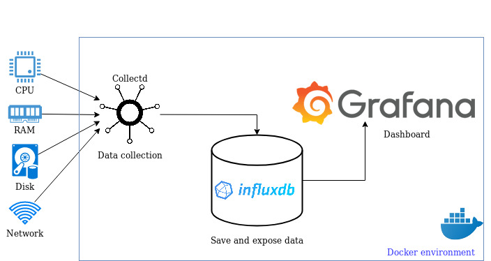

# (Grafana + InfluxDB + Telegraf) / Docker



This repository shows how to use a docker to setup a local telegraf, influxdb,
grafana stack.

You can use this repository to try collect system data, store it in influxdb
and create graph chart in Grafana.


# Installation

* Clone this repository and run:

```
$ docker-compose up -d --build
```

* Then you can open <http://localhost:3000>  grafana web page (login with admin/admin)


# Install on swarm cluster

- Setup Swarm Cluster

```bash
docker stack deploy --with-registry-auth --compose-file docker-compose.yml cluster-monitor


# cleanup
docker stack rm cluster-monitor

## cleanup persistent files (run with sudo)
rm -r grafana-storage/*
rm -r influxdb-data/*

## if you don't have sudo access (use docker)
docker run -v $(pwd)/influxdb-data:/influxdb-data -v $(pwd)/grafana-storage:/grafana-storage ubuntu:16.04 /bin/bash -c "rm -rf /influxdb-data/* /grafana-storage/*"
```
